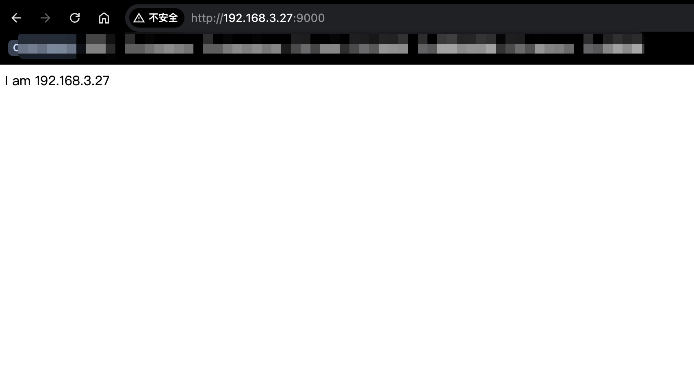
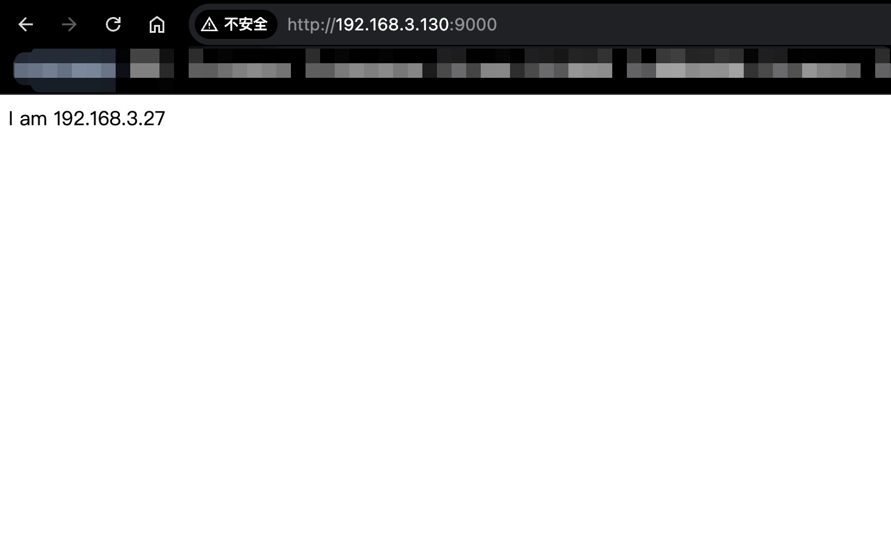
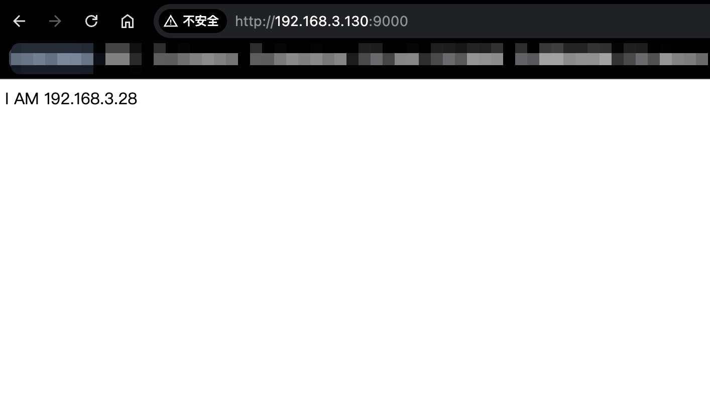

# KeepAlived + Nginx 高可用
## 环境准备
1. ubuntu server 20.04 (两台虚拟机，安装于 Ubuntu20.04 Desktop笔记本(IP:192.168.3.198))
   - 192.168.3.27 主
   - 192.168.3.28 备
   - 虚拟IP（VIP）‌：192.168.3.130（客户端访问的IP），就这个网段未被占用的IP
   - 设置固定ip (ubuntu server)
     ```txt
        wei@wei:~/Berries-NGINX/000.SOURCE_CODE/NGINX-1.24.0/build-output$ cat /etc/netplan/00-installer-config.yaml 
        # This is the network config written by 'subiquity'
        network:
          renderer: networkd
          ethernets:
            ens33:
              addresses:
                - 192.168.3.27/24
              nameservers:
                addresses: [4.2.2.2,8.8.8.8]
              routes:
                - to: default
                  via: 192.168.3.1
          version: 2

         sudo netplan apply
     ```

2. Nginx
   ```txt
      # git@github.com:Berries-Wang/Berries-NGINX.git
      分别在两个server上安装nginx
   ```

## 实验开始
### 1. 在ubuntu server上安装keepalived
```shell
    # 192.168.3.27
    # 192.168.3.28
wei@wei:~$ sudo apt-get install keepalived
```

### 2. 启动Nginx
- 192.168.3.27: 
- 192.168.3.28: 

### 3. 配置keepalived
##### a. 主 192.168.3.27
```shell 
wei@wei:~$ sudo vim /etc/keepalived/keepalived.conf

## 定义虚拟路由， VI_1 为虚拟路由的标示符，自己定义名称
vrrp_instance VI_1 {
	state MASTER ## 主节点为 MASTER， 对应的备份节点为 BACKUP
	interface ens33 ## 绑定虚拟 IP 的网络接口，与本机 IP 地址所在的网络接口相同， 我的是 eth0
	virtual_router_id 33 ## 虚拟路由的 ID 号， 两个节点设置必须一样， 可选 IP 最后一段使用, 相同的 VRID 为一个组，他将决定多播的 MAC 地址
	mcast_src_ip 192.168.3.27 ## 本机 IP 地址
	priority 100 ## 节点优先级， 值范围 0-254， MASTER 要比 BACKUP 高
	nopreempt ## 优先级高的设置 nopreempt 解决异常恢复后再次抢占的问题
	advert_int 1 ## 组播信息发送间隔，两个节点设置必须一样， 默认 1s
	# 虚拟 IP 池, 两个节点设置必须一样
	virtual_ipaddress {
		192.168.3.130 ## 虚拟 ip，可以定义多个
	}
}

wei@wei:~/Berries-NGINX/000.SOURCE_CODE/NGINX-1.24.0$ service keepalived start
==== AUTHENTICATING FOR org.freedesktop.systemd1.manage-units ===
Authentication is required to start 'keepalived.service'.
Authenticating as: wei
Password: 
==== AUTHENTICATION COMPLETE ===
wei@wei:~/Berries-NGINX/000.SOURCE_CODE/NGINX-1.24.0$ systemctl  status keepalived.service 
● keepalived.service - Keepalive Daemon (LVS and VRRP)
     Loaded: loaded (/lib/systemd/system/keepalived.service; ena>
     Active: active (running) since Sun 2025-03-23 14:09:49 UTC;>
   Main PID: 10300 (keepalived)
      Tasks: 2 (limit: 2234)
     Memory: 2.7M
     CGroup: /system.slice/keepalived.service
             ├─10300 /usr/sbin/keepalived --dont-fork
             └─10313 /usr/sbin/keepalived --dont-fork

Mar 23 14:09:49 wei Keepalived[10300]: Starting Keepalived v2.0.>
Mar 23 14:09:49 wei Keepalived[10300]: WARNING - keepalived was >
Mar 23 14:09:49 wei Keepalived[10300]: Command line: '/usr/sbin/>
Mar 23 14:09:49 wei Keepalived[10300]: Opening file '/etc/keepal>
Mar 23 14:09:49 wei Keepalived[10300]: Starting VRRP child proce>
Mar 23 14:09:49 wei Keepalived_vrrp[10313]: Registering Kernel n>
Mar 23 14:09:49 wei Keepalived_vrrp[10313]: Registering Kernel n>
Mar 23 14:09:49 wei Keepalived_vrrp[10313]: Opening file '/etc/k>
Mar 23 14:09:49 wei Keepalived_vrrp[10313]: Registering gratuito>
Mar 23 14:09:49 wei Keepalived_vrrp[10313]: (VI_1) Entering BACK>
lines 1-20
```
##### b. 备 192.168.3.28
```shell
wei@wei:~$ sudo vim /etc/keepalived/keepalived.conf
    vrrp_instance VI_1 {
    	state BACKUP
    	interface ens33
    	virtual_router_id 33
    	mcast_src_ip 192.168.3.28
    	priority 90
    	advert_int 1
    	virtual_ipaddress {
    		192.168.3.130
    	}
    }
```

### 4. 访问虚拟ip： 192.168.3.130

> 通过页面可知，目前访问的主服务器（主路由器）
#### 此时(主节点提供服务)查看主节点网卡以及IP
```shell
wei@wei:~$ ip a
1: lo: <LOOPBACK,UP,LOWER_UP> mtu 65536 qdisc noqueue state UNKNOWN group default qlen 1000
    link/loopback 00:00:00:00:00:00 brd 00:00:00:00:00:00
    inet 127.0.0.1/8 scope host lo
       valid_lft forever preferred_lft forever
    inet6 ::1/128 scope host 
       valid_lft forever preferred_lft forever
2: ens33: <BROADCAST,MULTICAST,UP,LOWER_UP> mtu 1500 qdisc fq_codel state UP group default qlen 1000
    link/ether 00:0c:29:ae:ac:db brd ff:ff:ff:ff:ff:ff
    inet 192.168.3.27/24 brd 192.168.3.255 scope global ens33
       valid_lft forever preferred_lft forever
    inet 192.168.3.130/32 scope global ens33
       valid_lft forever preferred_lft forever
    inet6 fe80::20c:29ff:feae:acdb/64 scope link 
       valid_lft forever preferred_lft forever
wei@wei:~$ 
# 可以发现，ens33 网卡多了一个IP: 192.168.3.130/32 , 这就是我们设置的虚拟IP

# 查阅资料，以下内容是什么意思: 001.KeepAlived/098.STU-DOCS/keepalived-doc-readthedocs-io-zh-cn-latest.epub 
#         ----> VRRP协议报文用来将Master设备的优先级和状态通告给同一备份组的所有Backup设备 ———— 001.KeepAlived/098.STU-DOCS/VRRP原理描述/002.VRRP协议报文.pdf
#         ---> VRRP备份组中的设备根据优先级选举出Master。Master设备通过发送免费ARP报⽂，将虚拟MAC地址通知给与它连接的设备或者主机，从⽽承担报文 # 001.KeepAlived/098.STU-DOCS/VRRP原理描述/003.VRRP工作原理.pdf # VRRP工作过程

wei@wei:~/Berries-NGINX/000.SOURCE_CODE/NGINX-1.24.0/build-output$ sudo tcpdump -i ens33 -nn host 224.0.0.18
tcpdump: verbose output suppressed, use -v or -vv for full protocol decode
listening on ens33, link-type EN10MB (Ethernet), capture size 262144 bytes
15:01:41.757801 IP 192.168.3.27 > 224.0.0.18: VRRPv2, Advertisement, vrid 33, prio 100, authtype none, intvl 1s, length 20
15:01:42.758576 IP 192.168.3.27 > 224.0.0.18: VRRPv2, Advertisement, vrid 33, prio 100, authtype none, intvl 1s, length 20
15:01:43.759424 IP 192.168.3.27 > 224.0.0.18: VRRPv2, Advertisement, vrid 33, prio 100, authtype none, intvl 1s, length 20
```

### 5. 将主（192.168.3.27）关机，再次访问

> 通过截图可以发现，服务正常访问。此时访问nginx的访问日志，可以发现，当前访问请求到了备节点

#### 此时（主节点宕机，备用节点提供服务），查看备用节点的网卡以及IP
```shell
wei@wei:~/Berries-NGINX/000.SOURCE_CODE/NGINX-1.24.0/build-output$ ip a
1: lo: <LOOPBACK,UP,LOWER_UP> mtu 65536 qdisc noqueue state UNKNOWN group default qlen 1000
    link/loopback 00:00:00:00:00:00 brd 00:00:00:00:00:00
    inet 127.0.0.1/8 scope host lo
       valid_lft forever preferred_lft forever
    inet6 ::1/128 scope host 
       valid_lft forever preferred_lft forever
2: ens33: <BROADCAST,MULTICAST,UP,LOWER_UP> mtu 1500 qdisc fq_codel state UP group default qlen 1000
    link/ether 00:0c:29:a3:79:f1 brd ff:ff:ff:ff:ff:ff
    inet 192.168.3.28/24 brd 192.168.3.255 scope global ens33
       valid_lft forever preferred_lft forever
    inet 192.168.3.130/32 scope global ens33
       valid_lft forever preferred_lft forever
    inet6 fe80::20c:29ff:fea3:79f1/64 scope link 
       valid_lft forever preferred_lft forever
# 此时，虚拟IP由主节点(3.27) 转移到了备用节点(3.28)的网卡上来了

wei@wei:~/Berries-NGINX/000.SOURCE_CODE/NGINX-1.24.0/build-output$ sudo tcpdump -i ens33 -nn host 224.0.0.18
tcpdump: verbose output suppressed, use -v or -vv for full protocol decode
listening on ens33, link-type EN10MB (Ethernet), capture size 262144 bytes
15:02:20.795376 IP 192.168.3.27 > 224.0.0.18: VRRPv2, Advertisement, vrid 33, prio 100, authtype none, intvl 1s, length 20
15:02:21.795913 IP 192.168.3.27 > 224.0.0.18: VRRPv2, Advertisement, vrid 33, prio 100, authtype none, intvl 1s, length 20
15:02:22.796340 IP 192.168.3.27 > 224.0.0.18: VRRPv2, Advertisement, vrid 33, prio 100, authtype none, intvl 1s, length 20
15:02:23.796876 IP 192.168.3.27 > 224.0.0.18: VRRPv2, Advertisement, vrid 33, prio 100, authtype none, intvl 1s, length 20
15:02:24.797410 IP 192.168.3.27 > 224.0.0.18: VRRPv2, Advertisement, vrid 33, prio 100, authtype none, intvl 1s, length 20
15:02:25.357406 IP 192.168.3.27 > 224.0.0.18: VRRPv2, Advertisement, vrid 33, prio 0, authtype none, intvl 1s, length 20
# 当 将主节点关机
15:02:26.006694 IP 192.168.3.28 > 224.0.0.18: VRRPv2, Advertisement, vrid 33, prio 90, authtype none, intvl 1s, length 20
15:02:27.006850 IP 192.168.3.28 > 224.0.0.18: VRRPv2, Advertisement, vrid 33, prio 90, authtype none, intvl 1s, length 20
15:02:28.007315 IP 192.168.3.28 > 224.0.0.18: VRRPv2, Advertisement, vrid 33, prio 90, authtype none, intvl 1s, length 20
15:02:29.007944 IP 192.168.3.28 > 224.0.0.18: VRRPv2, Advertisement, vrid 33, prio 90, authtype none, intvl 1s, length 20
15:02:30.008547 IP 192.168.3.28 > 224.0.0.18: VRRPv2, Advertisement, vrid 33, prio 90, authtype none, intvl 1s, length 20
15:02:31.009234 IP 192.168.3.28 > 224.0.0.18: VRRPv2, Advertisement, vrid 33, prio 90, authtype none, intvl 1s, length 20

```

### 6. 当主（192.168.3.27）重启
当主重启后，重新访问虚拟IP，可以发现，访问请求到了主节点。

### 7. 当主/备正常提供服务，查看一下主节点的网卡以及端口
- 通过上述实验流程，查看以下各自提供正常流程时的输出：
  + ip a 的输出，查看网卡和IP(着重虚拟ip)
  + sudo tcpdump -i ens33 -nn host 224.0.0.18 的输出，即告诉这个集群（vrid 33），我的优先级最高，我获取VIP的使用权，也就是我来提供服务.

### 8. 实验总结
1. VRRP 工作过程
2. VRRP会将虚拟IP和本机<sub>正常是主节点，主节点挂了，就是优先级最高的备节点</sub>网卡绑定——IP持有者 <sup>参考:[001.KeepAlived/098.STU-DOCS/VRRP原理描述/001.VRRP概述.pdf](../098.STU-DOCS/VRRP原理描述/001.VRRP概述.pdf)</sup>，从而通过虚拟IP访问。

---

### 9. 其他
##### 1. Connection: Keep-Alive
出现在浏览器的请求头 & 响应头，这个可不是这里的keepalived , Connection: Keep-Alive 表示:  &nbsp;&nbsp;&nbsp;&nbsp;&nbsp;&nbsp;HTTP持久连接（英语：HTTP persistent connection，也称作HTTP keep-alive或HTTP connection reuse）是使用同一个TCP连接来发送和接收多个HTTP请求/应答的方法。使用该方法可以避免为每一个新的请求/应答打开一个新的连接。