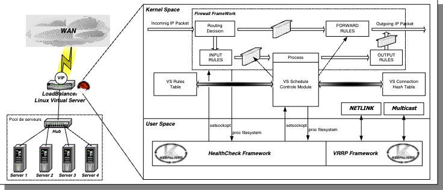

# keepalived
Keepalived is a routing software written in C. The main goal of this project is to provide simple and robust facilities for loadbalancing and high-availability to Linux system and Linux based infrastructures. Loadbalancing framework relies on well-known and widely used Linux Virtual Server (IPVS) kernel module providing Layer4 loadbalancing. Keepalived implements a set of checkers to dynamically and adaptively maintain and manage loadbalanced server pool according their health. On the other hand `high-availability is achieved by VRRP protocol`. VRRP[什么是VRRP](./098.STU-DOCS/什么是VRRP，VRRP有哪些应用？%20-%20华为.pdf) & [VRRP原理](./098.STU-DOCS/VRRP原理描述/) is a fundamental brick for router failover. In addition, Keepalived implements a set of hooks to the VRRP finite state machine providing low-level and high-speed protocol interactions. In order to offer fastest network failure detection, Keepalived implements BFD protocol. VRRP state transition can take into account BFD hint to drive fast state transition. Keepalived frameworks can be used independently or all together to provide resilient infrastructures. (Keepalived 是一款用 C 语言编写的路由软件。该项目的主要目标是为 Linux 系统和基于 Linux 的基础设施提供简单而强大的负载均衡和高可用性功能。负载均衡框架依赖于众所周知且广泛使用的 Linux 虚拟服务器（IPVS）内核模块，提供第四层（Layer4）负载均衡。Keepalived 实现了一组检查器，根据服务器的健康状况动态且自适应地维护和管理负载均衡的服务器池。另一方面，`高可用性通过 VRRP 协议实现`。VRRP 是路由器故障切换的基本构建块。此外，Keepalived 实现了对 VRRP 有限状态机的一组钩子，提供了低层次和高速的协议交互。为了提供最快的网络故障检测，Keepalived 实现了 BFD 协议。VRRP 状态转换可以考虑 BFD 提示，以驱动快速状态转换。Keepalived 的框架可以独立使用，也可以一起使用，以提供弹性的基础设施。)

Keepalived uses the IP Virtual Server (IPVS) kernel module to provide transport layer (Layer 4) load balancing, redirecting requests for network-based services to individual members of a server cluster. IPVS monitors the status of each server and uses the Virtual Router Redundancy Protocol (VRRP) to implement high availability.（Keepalived 使用 IP 虚拟服务器 （IPVS） 内核模块提供传输层（第 4 层）负载平衡，将基于网络的服务请求重定向到服务器集群的各个成员。IPVS 监控每台服务器的状态，并使用虚拟路由器冗余协议 （VRRP） 实现高可用性。）
  - FROM: [https://docs.oracle.com/en/operating-systems/oracle-linux/6/admin/ol6-about-keepalive.html](https://docs.oracle.com/en/operating-systems/oracle-linux/6/admin/ol6-about-keepalive.html)

## 功能
- 基于VRRPVirtual Router Redundancy Protocol: 虚拟路由冗余协议，采用IP多播的方式实现主备之间的通信协议完成地址流动
  + VRRP工作时主节点发包，备节点接包，当备节点接收不到主节点发的数据包时，就启动接管程序接管主节点任务。
  + VRRP是通过一种竞选协议来将路由任务交给某台VRRP路由器
- 为VIP地址所在的节点生成IPVS规则（在配置文件中预先定义）
- 为IPVS集群的各RS做健康状态检测
- 基于脚本调用接口完成脚本中定义的功能，进而影响集群事务，以此支持Nginx ， haproxy等服务

## 架构
> 

总体流程: 
  - 

通过阅读[Keepalived for LVS-UserGuide#3.1 Global View and localization](./098.STU-DOCS/Keepalived%20for%20LVS-UserGuide.pdf) 发现，会将请求到虚拟IP的数据包进行`转发`

---

## 专业名词
- CIP： Client IP ， 客户端IP地址.
- VIP： Virtual IP，LVS面向用户的请求的IP地址
- DIP： Director IP , LVS和后端服务器通信的IP地址
- RIP: Real Server IP , 后端服务器用于和LVS通信的IP地址

## 参考
1. [https://www.keepalived.org/](https://www.keepalived.org/)
2. [https://keepalived-doc.readthedocs.io/](https://keepalived-doc.readthedocs.io/)