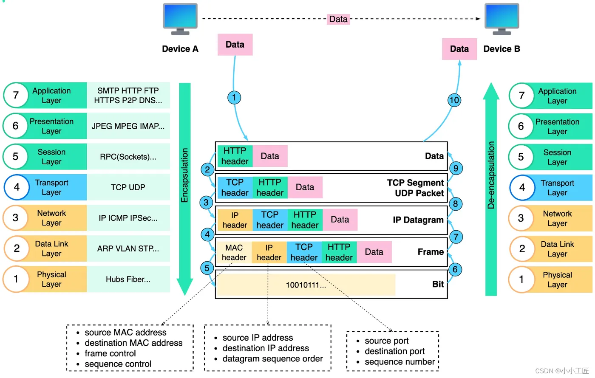
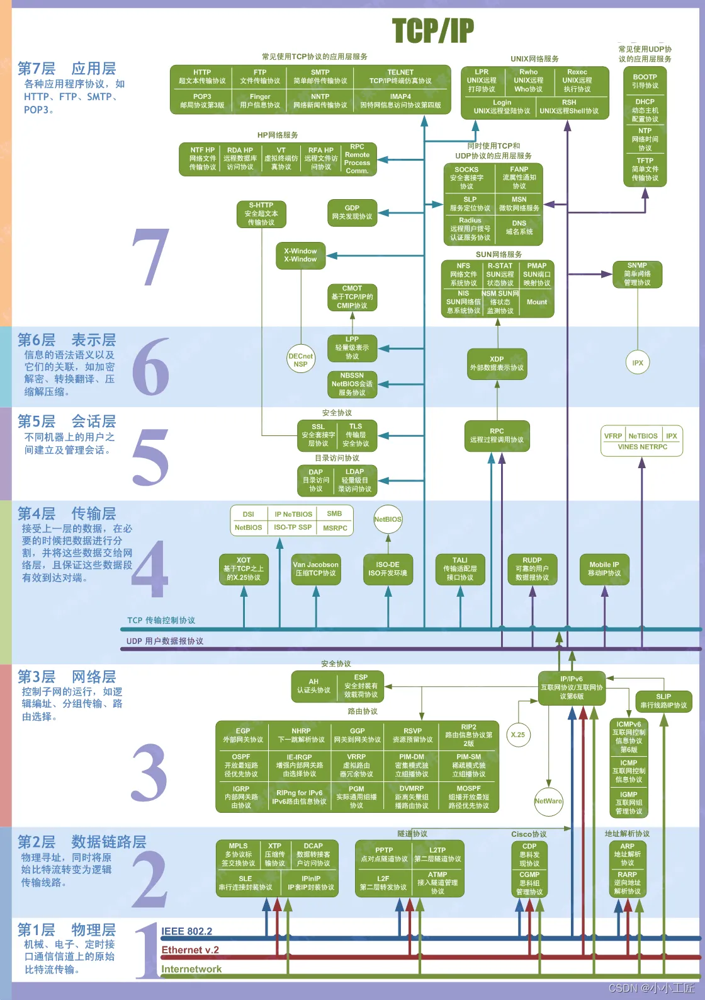

# OSI 七层模型
OSI（开放系统互联模型，Open Systems Interconnection Model）是一个用于理解和描述计算机网络体系结构的标准化框架，由国际标准化组织（ISO）于1984年制定。该模型将计算机网络通信划分为七个不同的层次，每个层次都执行特定的功能，并且每个层次都依赖于其下一层的服务。

以下是OSI模型的七个层次，从物理层到应用层：
1. 物理层（Physical Layer）：物理层是网络通信的最底层，主要关注物理媒介和传输数据的硬件特性。它定义了数据传输的物理介质，如电缆、光纤、无线电波等。主要任务包括数据的编码、传输速率、电压水平等。
2.  数据链路层（Data Link Layer）：数据链路层负责将原始比特流组织成数据帧，并在物理介质上进行可靠的传输。这一层还负责物理地址（MAC地址）的识别和帧的错误检测与校正。常见的数据链路协议包括以太网（Ethernet）和Wi-Fi。
3.  网络层（Network Layer）：网络层的主要任务是路由数据包，决定数据包的最佳路径从源到目的地。IP（Internet Protocol）是网络层最著名的协议，负责地址分配和数据包转发。
4.  传输层（Transport Layer）：传输层提供端到端的数据传输服务，确保数据的可靠性和完整性。常见的传输层协议包括TCP（传输控制协议）和UDP（用户数据报协议）。
 5. 会话层（Session Layer）：会话层负责建立、管理和终止会话（会话是指两个设备之间的通信会话）。它还可以处理会话中的同步和恢复问题。
 6. 表示层（Presentation Layer）：表示层主要关注数据的格式化和编解码，以确保不同系统间的数据交换。它可以处理数据的加密、压缩和数据格式转换。
 7.   应用层（Application Layer）：应用层是最高层，为最终用户提供应用程序和网络服务。这包括诸如Web浏览器、电子邮件客户端、文件传输协议（FTP）等应用。与用户界面和应用程序通信的所有应用层协议都属于此层。

### OSI 七层示意图

