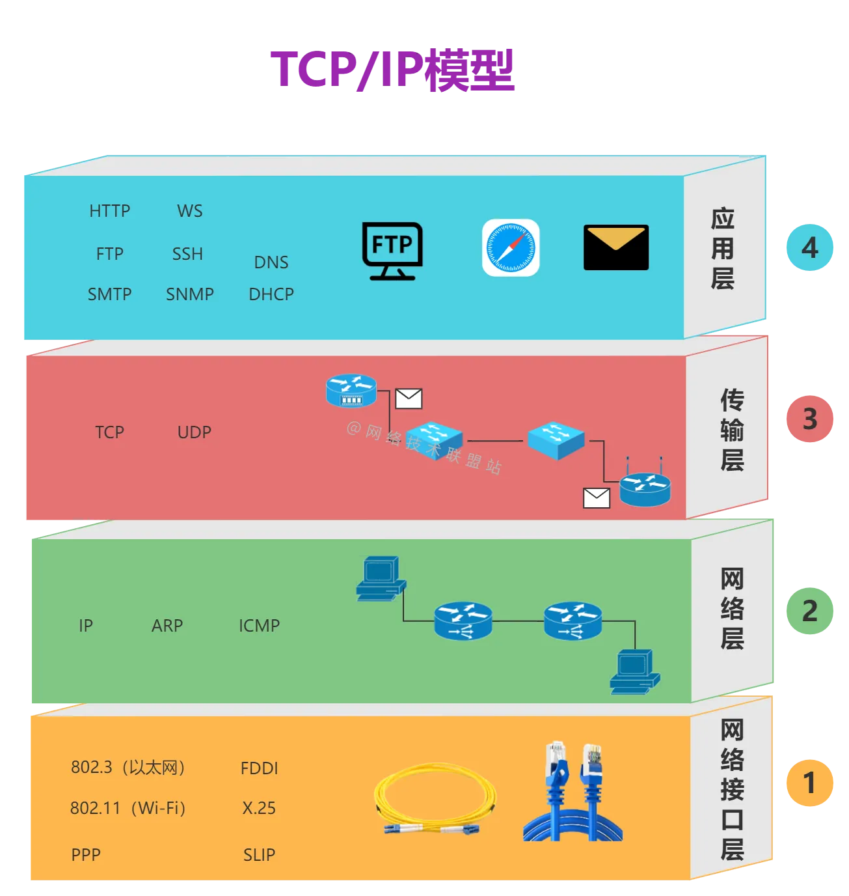

# TCP/IP四层模型
TCP/IP四层模型，也被称为Internet协议套件。与OSI七层模型不同，TCP/IP模型将网络协议分为四个主要层次，这是实际互联网通信所采用的标准模型。以下是TCP/IP四层模型的层次：

1. 网络接口层（Network Interface Layer）：这一层与OSI模型的数据链路层和物理层合并在一起，负责管理物理硬件和数据链路协议，以便将数据从一个设备传输到下一个。它包括了硬件和驱动程序，如以太网卡，Wi-Fi适配器等，以及与数据链路相关的协议，如以太网、Wi-Fi等。
2.    网络层（Internet Layer）：这一层与OSI模型的网络层相对应，负责路由数据包，确保它们能够从源主机传输到目的主机。IP协议是网络层的核心协议，用于标识和定位设备，以及确定数据包的最佳路径。
 3.   传输层（Transport Layer）：传输层与OSI模型的传输层相对应，它负责端到端的数据传输，确保数据的可靠性和完整性。在TCP/IP模型中，最著名的协议是TCP和UDP。TCP提供可靠的、面向连接的通信，而UDP提供不可靠但更快速的通信。
 4.   应用层（Application Layer）：应用层与OSI模型的应用层相对应，它包括了应用程序和用户接口。在这个层次，各种应用层协议和服务运行，如HTTP（用于Web浏览）、SMTP（用于电子邮件）、FTP（用于文件传输）等。

与OSI模型不同，TCP/IP模型较为简化，因为它将数据链路层和物理层合并为一个单独的网络接口层，并且更贴近实际互联网协议的使用情况。它是构建和管理互联网通信的基础，因此更常见和实际。但请注意，TCP/IP模型与OSI模型之间存在类似的概念和对应关系，只是层次划分不同。

### TCP/IP示意图
