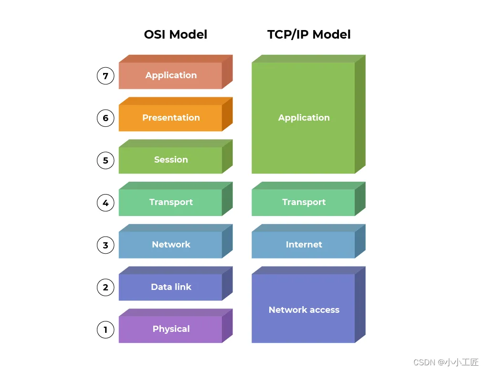

# 计算机网络

OSI七层模型和TCP/IP四层模型是两种不同的网络协议层次模型，用于帮助理解和描述计算机网络通信的不同方面。它们有一些相似之处，但也有明显的区别：

相似之处：
1. 分层结构：两种模型都采用了分层的方法，将网络通信划分为多个层次，每个层次负责特定的功能。这有助于模块化网络设计和协议的开发，提高了互操作性。
2. 应用层：两种模型都包括应用层，这是最高层，为最终用户提供应用程序和服务。
3. 传输层：在两种模型中都有传输层，负责端到端的数据传输，确保数据的可靠性和完整性。
4. 网络层：两种模型中都有网络层，负责路由数据包，决定数据包的路径。
5. 数据链路/网络接口层：虽然名称不同，但它们都包括处理物理层和数据链路层功能的层次。

不同之处：
1. 层次数量：
    - OSI模型有七个层次，而TCP/IP模型只有四个层次。
    - OSI模型更详细地分解了网络通信的不同方面，包括会话层和表示层，而TCP/IP模型较为简化。
2. 具体协议：
    - OSI模型没有指定具体的协议，而只是提供了一种通用的框架。因此，不同的协议可以用于每个层次。
    - TCP/IP模型在每个层次上定义了特定的协议，如IP、TCP、UDP等。这些协议在实际互联网通信中广泛使用。
3. 实际应用：
    - TCP/IP模型是实际互联网通信的基础，因为它更直接地反映了实际使用的协议和体系结构。
    - OSI模型更常用于教育和理论领域，而实际网络工程更多地采用TCP/IP模型。
4. 历史背景：
    - OSI模型是由国际标准化组织（ISO）制定，于1984年发布，旨在提供一种通用的网络参考模型。
    - TCP/IP模型是在实际互联网的发展中逐渐演化而来，更贴近实际需求，最早是由美国国防部（DoD）开发的。

总的来说，OSI七层模型和TCP/IP四层模型都有其用途，但在实际网络工程和互联网通信中，TCP/IP模型更为常见和实际。它们之间的对应关系可以帮助理解和比较不同协议和网络技术。

总结一下，OSI七层模型提供了一个通用的框架，用于理解计算机网络通信的不同方面。每一层都有其特定的功能和任务，通过这种分层的方法，不同层次之间的交互变得更加清晰和可维护。不同的网络协议和技术在这个模型中可以很容易地定位到其相应的层次。